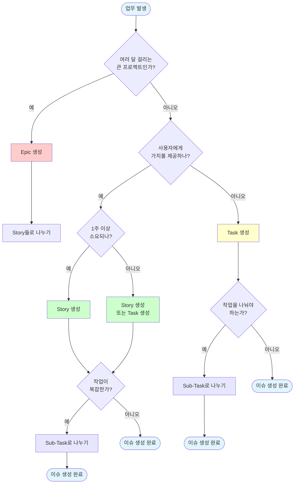

# Jira 운영 규칙

POPUP STUDIO의 모든 업무는 Jira를 통해 관리됩니다. 이 문서는 **Jira를 처음 사용하는 비개발자**도 쉽게 이해하고 활용할 수 있도록 작성되었습니다.

---

## Jira란?

**Jira**는 팀의 업무를 **이슈(Issue)**라는 단위로 관리하는 도구입니다.

**이슈**는 쉽게 말해 "해야 할 일"을 의미합니다:
- 새로운 기능 개발
- 버그 수정
- 디자인 작업
- 마케팅 캠페인
- 문서 작성
- 회의 준비

모든 업무를 이슈로 만들어 관리하면:
- ✅ 누가 무엇을 하고 있는지 명확
- ✅ 업무 진행 상황 추적 가능
- ✅ 업무가 누락되지 않음
- ✅ 히스토리가 남아 나중에 참고 가능

---

## 이슈 타입 구분 - 쉬운 비유

Jira의 이슈 타입을 **집 짓기**에 비유하면 이해하기 쉽습니다:

| 이슈 타입 | 비유 | 설명 | 규모 |
|---------|------|------|------|
| **Epic** | 🏗️ 집 전체 | 큰 프로젝트 또는 목표 | 몇 주 ~ 몇 달 |
| **Story** | 🏠 방 하나 | 의미 있는 완성 단위 | 며칠 ~ 1주 |
| **Task** | 🔨 단독 작업 | 특정 작업 하나 | 반나절 ~ 며칠 |
| **Sub-Task** | 🔩 세부 단계 | Story/Task의 작은 단계 | 몇 시간 ~ 하루 |

### 구체적인 예시:

**Epic**: "신규 웹사이트 런칭"
- Story 1: "메인 페이지 디자인 및 개발"
- Story 2: "회원가입 기능 개발"
- Story 3: "결제 시스템 연동"
- Story 4: "마케팅 랜딩 페이지 제작"

**Story**: "메인 페이지 디자인 및 개발"
- Sub-Task 1: 와이어프레임 작성
- Sub-Task 2: 디자인 시안 제작
- Sub-Task 3: HTML/CSS 퍼블리싱
- Sub-Task 4: 반응형 작업

**Task**: "구글 애널리틱스 설치" (독립적인 작업, Story에 속하지 않음)

---

## 담당자 지정 원칙 (중요!)

이슈 타입에 따라 **담당자의 의미**가 다릅니다:

| 이슈 타입 | 담당자 의미 | 누구를 지정? | 역할 |
|---------|------------|------------|------|
| **Epic** | 📋 책임자/리드 | PM, 팀장 등 | 전체 프로젝트 관리 및 조율 |
| **Story** | 📋 책임자/리드 | 기능 담당자 | Story 완성 책임 및 조율 |
| **Task** | 👤 실행 담당자 | 실제 작업자 | 직접 작업 수행 |
| **Sub-Task** | 👤 실행 담당자 | 실제 작업자 | 직접 작업 수행 |

### 핵심 원칙

**Epic과 Story**:
- **책임자(Owner/Lead)**를 지정 (선택사항)
- 직접 일하는 사람이 아니라 **전체를 관리하고 조율**하는 사람
- 여러 사람이 협업하는 경우, 전체 진행을 책임지는 리드
- 지정하지 않아도 됨

**Task와 Sub-Task**:
- **실행 담당자(Assignee)**를 지정 (필수)
- 실제로 **손으로 일하는 사람**
- 코드를 짜거나, 디자인을 만들거나, 문서를 작성하는 사람
- 반드시 한 명만 지정 (공동 작업은 Sub-Task로 나누기)

### 예시

```
Epic: "신규 회원가입 시스템 구축"
└─ 담당자: 김PM (프로젝트 전체 책임자)

   ├─ Story 1: "사용자가 이메일로 회원가입할 수 있다"
   │  └─ 담당자: 이개발 (이 Story 리드, 선택사항)
   │     ├─ Sub-Task 1: 회원가입 UI 개발
   │     │  └─ 담당자: 박프론트 ✅ (실제 작업자)
   │     ├─ Sub-Task 2: 회원가입 API 개발
   │     │  └─ 담당자: 최백엔드 ✅ (실제 작업자)
   │     └─ Sub-Task 3: 이메일 인증 개발
   │        └─ 담당자: 최백엔드 ✅ (실제 작업자)
   │
   ├─ Story 2: "사용자가 소셜 로그인으로 회원가입할 수 있다"
   │  └─ 담당자: 없음 (Story 리드 없이 Sub-Task만 할당)
   │     ├─ Sub-Task 1: 구글 로그인 연동
   │     │  └─ 담당자: 정백엔드 ✅ (실제 작업자)
   │     └─ Sub-Task 2: 페이스북 로그인 연동
   │        └─ 담당자: 정백엔드 ✅ (실제 작업자)
   │
   └─ Task: "회원가입 정책 문서 작성"
      └─ 담당자: 강기획 ✅ (실제 작업자)
```

### 왜 이렇게 구분하나요?

1. **역할 명확화**
   - Epic/Story 담당자 = "전체를 보는 사람"
   - Task/Sub-Task 담당자 = "손으로 일하는 사람"

2. **추적 용이성**
   - 실제로 누가 무슨 일을 하고 있는지 명확
   - Epic/Story에 담당자를 지정하면 실제 작업자가 불명확

3. **자율성 보장**
   - 팀원들이 Task/Sub-Task를 스스로 선택
   - Epic/Story는 큰 그림, 세부 실행은 각자 판단

### 실무 적용

**매일 아침 `/daily-standup` 실행 시**:
```bash
/daily-standup
```
→ **Task/Sub-Task 중 미할당 이슈**를 확인하고 선택
→ Epic/Story는 이미 책임자가 지정되어 있거나 지정 불필요

**담당자로 자신을 지정할 때**:
```bash
# Task 또는 Sub-Task만 지정
/assign-me PROJ-145  # Task: "서버 로그 모니터링 설정"
/assign-me PROJ-148  # Sub-Task: "회원가입 UI 개발"

# Epic이나 Story는 책임자만 지정 (선택사항)
```

---

## 각 이슈 타입 상세 설명

### 1. Epic (에픽) 🏗️

**정의**: 여러 Story를 포함하는 **큰 목표나 프로젝트**

**특징**:
- 완료하는데 **몇 주 ~ 몇 달** 소요
- 여러 팀원이 협업
- 명확한 비즈니스 가치가 있음
- 여러 Story로 나누어 진행

**담당자 지정**:
- 📋 **책임자/리드** 지정 (선택사항)
- 프로젝트 매니저, 팀장, 또는 전체 조율자
- 직접 일하는 사람이 아니라 **전체를 관리하는 사람**
- 지정하지 않아도 괜찮음

**언제 만드나요?**
- ✅ 새로운 서비스나 기능을 런칭할 때
- ✅ 큰 규모의 리뉴얼이나 개선 작업
- ✅ 분기별 핵심 목표
- ✅ 여러 부서가 협업하는 프로젝트

**직군별 예시**:

**기획팀**:
- "신규 멤버십 서비스 기획 및 런칭"
- "사용자 온보딩 플로우 개선 프로젝트"
- "Q1 주요 기능 로드맵"

**디자인팀**:
- "브랜드 리뉴얼 프로젝트"
- "디자인 시스템 구축"
- "모바일 앱 UI/UX 개선"

**마케팅팀**:
- "2024 상반기 마케팅 캠페인"
- "브랜드 인지도 향상 프로젝트"
- "신규 채널 확장 전략"

**개발팀**:
- "결제 시스템 마이그레이션"
- "성능 최적화 프로젝트"
- "인프라 현대화"

---

### 2. Story (스토리) 🏠

**정의**: **사용자나 비즈니스에 가치를 제공하는 독립적인 기능 단위**

**특징**:
- 완료하는데 **며칠 ~ 1주** 정도 소요
- 완료 시 사용자가 체감할 수 있는 결과물
- "~할 수 있다" 형태로 표현 가능
- Epic에 속하거나 독립적으로 존재

**담당자 지정**:
- 📋 **책임자/리드** 지정 (선택사항)
- 이 Story 완성을 책임지고 조율하는 사람
- 여러 Sub-Task가 있을 때, 전체를 관리하는 리드
- 혼자 작업하거나 간단한 Story는 지정하지 않아도 됨
- **실제 작업은 Sub-Task에 담당자 지정**

**언제 만드나요?**
- ✅ 사용자가 사용할 새로운 기능
- ✅ 사용자 경험을 개선하는 작업
- ✅ 비즈니스 가치가 명확한 작업
- ✅ 다른 팀과 협업이 필요한 작업

**작성 방법**:
```
제목: [사용자 관점] + [할 수 있는 것]
예: 사용자가 소셜 로그인으로 회원가입할 수 있다

설명:
- 목적: 왜 이 작업이 필요한가?
- 요구사항: 무엇을 만들어야 하는가?
- 수용 기준: 어떻게 되어야 완료인가?
```

**직군별 예시**:

**기획팀**:
- "사용자가 앱에서 알림 설정을 관리할 수 있다"
- "관리자가 대시보드에서 통계를 확인할 수 있다"
- "사용자가 검색 필터로 원하는 상품을 찾을 수 있다"

**디자인팀**:
- "메인 페이지 디자인 리뉴얼"
- "모바일 앱 네비게이션 UI 개선"
- "로그인 페이지 사용성 개선"

**마케팅팀**:
- "3월 이벤트 랜딩 페이지 제작"
- "신규 브랜드 가이드 제작"
- "뉴스레터 템플릿 리뉴얼"

**개발팀**:
- "결제 API 연동"
- "이메일 알림 기능 개발"
- "관리자 페이지 권한 관리 기능"

---

### 3. Task (태스크) 🔨

**정의**: **기술적이거나 운영적인 독립 작업** (사용자가 직접 체감하지 않는 작업)

**특징**:
- 완료하는데 **반나절 ~ 며칠** 소요
- Story에 포함되지 않는 독립적인 작업
- 주로 내부 작업이나 운영 업무
- "~한다" 형태로 표현

**담당자 지정**:
- 👤 **실행 담당자** 지정 (필수)
- 실제로 **손으로 일하는 사람**
- 코드를 짜거나, 문서를 작성하거나, 직접 작업하는 사람
- 반드시 한 명만 지정 (공동 작업은 Sub-Task로 나누기)
- **매일 아침 미할당 Task를 확인하고 스스로 선택**

**언제 만드나요?**
- ✅ 기술 부채 해결
- ✅ 문서 작성
- ✅ 환경 설정
- ✅ 분석 및 조사
- ✅ 운영 업무

**Story vs Task 구분**:
- **Story**: 사용자에게 가치를 제공 → "~할 수 있다"
- **Task**: 내부 작업 또는 준비 작업 → "~한다"

**직군별 예시**:

**기획팀**:
- "경쟁사 서비스 분석 보고서 작성"
- "사용자 설문조사 진행"
- "요구사항 정의서 작성"
- "회의록 정리 및 공유"

**디자인팀**:
- "디자인 가이드 문서 업데이트"
- "아이콘 리소스 정리"
- "Figma 라이브러리 정리"
- "디자인 리뷰 미팅 준비"

**마케팅팀**:
- "월간 성과 보고서 작성"
- "광고 소재 제작"
- "SNS 콘텐츠 스케줄링"
- "마케팅 자료 번역"

**개발팀**:
- "서버 로그 모니터링 설정"
- "코드 리팩토링"
- "테스트 코드 작성"
- "배포 자동화 스크립트 작성"

**DevOps/운영팀**:
- "데이터베이스 백업 설정"
- "서버 보안 패치 적용"
- "모니터링 알람 설정"

---

### 4. Sub-Task (서브태스크) 🔩

**정의**: **Story나 Task를 완료하기 위한 작은 단계**

**특징**:
- 완료하는데 **몇 시간 ~ 하루** 정도 소요
- 상위 이슈(Story/Task)에 종속
- 세부적인 실행 단계
- 혼자서 완료 가능한 작은 단위

**담당자 지정**:
- 👤 **실행 담당자** 지정 (필수)
- 이 Sub-Task를 직접 수행하는 사람
- 한 명만 지정 (여러 명이 해야 하면 Sub-Task를 더 나누기)
- **매일 아침 미할당 Sub-Task를 확인하고 스스로 선택**

**언제 만드나요?**
- ✅ Story/Task가 너무 커서 나눠야 할 때
- ✅ 여러 단계로 진행해야 할 때
- ✅ 역할별로 작업을 나눌 때
- ✅ 진행 상황을 세밀하게 추적하고 싶을 때

**주의사항**:
- ❌ Sub-Task만 단독으로 생성하지 않음
- ❌ 너무 많이 나누지 않음 (5개 이하 권장)
- ✅ 상위 이슈 완료에 필요한 것만 생성

**예시**:

**Story**: "신규 회원가입 페이지 개발"
- Sub-Task 1: UI 디자인 (디자이너)
- Sub-Task 2: 프론트엔드 개발 (FE 개발자)
- Sub-Task 3: API 개발 (BE 개발자)
- Sub-Task 4: QA 테스트 (QA)

**Task**: "3월 마케팅 보고서 작성"
- Sub-Task 1: 데이터 수집
- Sub-Task 2: 차트 작성
- Sub-Task 3: 분석 및 인사이트 도출
- Sub-Task 4: 최종 검토 및 배포

---

## 이슈 타입 선택 가이드

### 의사결정 플로우차트



### 빠른 판단 기준표

| 질문 | Epic | Story | Task | Sub-Task |
|------|------|-------|------|----------|
| 완료 기간? | 몇 주~몇 달 | 며칠~1주 | 반나절~며칠 | 몇 시간~하루 |
| 사용자 가치? | ✅ | ✅ | ❌ (대부분) | 상위에 따름 |
| 독립적? | ✅ | ✅ | ✅ | ❌ |
| 여러 작업 포함? | ✅ | 때때로 | 때때로 | ❌ |
| 담당자 의미? | 📋 책임자/리드 | 📋 책임자/리드 | 👤 실행자 | 👤 실행자 |
| 담당자 지정? | 선택사항 | 선택사항 | 필수 | 필수 |

---

## 실제 시나리오별 예시

### 시나리오 1: 신규 기능 개발 (전체 프로세스)

**상황**: 사용자가 앱에서 포인트를 사용할 수 있는 기능을 만들어야 함

```
Epic: "포인트 시스템 구축"

├─ Story 1: "사용자가 포인트를 적립할 수 있다"
│  ├─ Sub-Task: 포인트 적립 UI 디자인
│  ├─ Sub-Task: 포인트 적립 API 개발
│  └─ Sub-Task: 포인트 내역 화면 개발
│
├─ Story 2: "사용자가 포인트를 사용할 수 있다"
│  ├─ Sub-Task: 포인트 사용 UI 디자인
│  ├─ Sub-Task: 포인트 차감 API 개발
│  └─ Sub-Task: 결제 연동 개발
│
├─ Story 3: "관리자가 포인트를 관리할 수 있다"
│  ├─ Sub-Task: 관리자 페이지 UI 개발
│  └─ Sub-Task: 포인트 조정 기능 개발
│
└─ Task: "포인트 정책 문서 작성"
```

---

### 시나리오 2: 마케팅 캠페인

**상황**: 3월 신규 고객 유치 캠페인 진행

```
Epic: "3월 신규 고객 유치 캠페인"

├─ Story 1: "이벤트 랜딩 페이지 제작"
│  ├─ Sub-Task: 랜딩 페이지 기획안 작성
│  ├─ Sub-Task: 디자인 시안 제작
│  └─ Sub-Task: 퍼블리싱 및 배포
│
├─ Story 2: "SNS 광고 캠페인 집행"
│  ├─ Sub-Task: 광고 소재 제작
│  ├─ Sub-Task: 광고 집행
│  └─ Sub-Task: 성과 모니터링
│
├─ Task: "경쟁사 캠페인 분석"
├─ Task: "이벤트 상세 기획서 작성"
└─ Task: "캠페인 결과 보고서 작성"
```

---

### 시나리오 3: 단순 작업들

**상황**: 일상적인 업무들

```
# Epic 없이 독립적으로 존재

Task: "3월 주간 회의록 작성"
├─ Sub-Task: 1주차 회의록
├─ Sub-Task: 2주차 회의록
├─ Sub-Task: 3주차 회의록
└─ Sub-Task: 4주차 회의록

Task: "디자인 리소스 정리"

Task: "고객 문의 FAQ 업데이트"

Task: "팀 온보딩 문서 업데이트"
```

---

## 잘못된 예시 vs 올바른 예시

### ❌ 잘못된 예시 1: Epic이 너무 작음

**잘못됨**:
```
Epic: "로그인 버튼 색상 변경"
```

**올바름**:
```
Task: "로그인 버튼 색상 변경"
```

**이유**: Epic은 몇 주~몇 달 걸리는 큰 프로젝트여야 함

---

### ❌ 잘못된 예시 2: Story인데 Task로 만듦

**잘못됨**:
```
Task: "회원가입 기능 개발"
```

**올바름**:
```
Story: "사용자가 이메일로 회원가입할 수 있다"
├─ Sub-Task: 회원가입 UI 개발
├─ Sub-Task: 회원가입 API 개발
└─ Sub-Task: 이메일 인증 기능 개발
```

**이유**: 사용자에게 가치를 제공하는 기능은 Story

---

### ❌ 잘못된 예시 3: Sub-Task를 독립적으로 생성

**잘못됨**:
```
Sub-Task: "디자인 시안 제작" (상위 이슈 없음)
```

**올바름**:
```
Story: "메인 페이지 리뉴얼"
└─ Sub-Task: 디자인 시안 제작
```

**이유**: Sub-Task는 반드시 상위 이슈에 속해야 함

---

### ❌ 잘못된 예시 4: Task인데 Story로 만듦

**잘못됨**:
```
Story: "서버 로그 모니터링 설정"
```

**올바름**:
```
Task: "서버 로그 모니터링 설정"
```

**이유**: 사용자가 체감하지 못하는 내부 작업은 Task

---

## FAQ (자주 묻는 질문)

### Q1: Story와 Task의 차이가 헷갈려요

**A**: 간단한 질문으로 판단하세요:
- "사용자나 고객이 이 작업의 결과를 체감하나요?"
  - **YES** → Story
  - **NO** → Task

**예시**:
- "사용자가 검색할 수 있다" → Story ✅
- "검색 API 성능 개선" → Task (사용자는 모름)
- "관리자 대시보드 개발" → Story (관리자도 사용자)
- "데이터베이스 백업 설정" → Task (내부 작업)

---

### Q2: 언제 Sub-Task를 만들어야 하나요?

**A**: 다음 경우에 Sub-Task를 만드세요:
- ✅ Story/Task가 너무 커서 진행 상황을 세밀하게 추적하고 싶을 때
- ✅ 여러 사람이 협업해야 할 때 (역할별로 나누기)
- ✅ 단계적으로 진행해야 할 때

**만들지 않아도 되는 경우**:
- ❌ 혼자서 하루 안에 끝낼 수 있는 작업
- ❌ 나누면 오히려 복잡해지는 작업

---

### Q3: Epic 없이 Story만 만들어도 되나요?

**A**: 네, 가능합니다!
- ✅ 독립적인 작은 기능은 Epic 없이 Story만 만들어도 됨
- ✅ Epic은 **큰 프로젝트를 그룹핑하는 도구**일 뿐
- ✅ 나중에 필요하면 Epic에 연결 가능

---

### Q4: 이슈를 잘못 만들었어요. 어떻게 하나요?

**A**: 걱정하지 마세요!
- Jira에서 이슈 타입 변경 가능
- 이슈 삭제 가능 (권한 필요)
- 처음엔 실수해도 괜찮습니다. 점점 익숙해집니다

---

### Q5: 이슈를 너무 많이 만들면 안 되나요?

**A**: 적절한 수준으로 만드세요:
- ✅ **좋은 예**: 의미 있는 작업 단위로 명확하게 나누기
- ❌ **나쁜 예**: 너무 세세하게 쪼개서 관리가 복잡해짐

**기준**:
- Story: 며칠~1주 단위
- Task: 반나절~며칠 단위
- Sub-Task: 몇 시간~하루 단위

---

### Q6: Epic이나 Story에도 담당자를 지정하나요?

**A**: Epic과 Story는 **책임자/리드**를 지정하며, 선택사항입니다:

**Epic**:
- 📋 프로젝트 전체 책임자/리드 (PM, 팀장 등)
- 선택사항: 작은 Epic은 지정하지 않아도 됨

**Story**:
- 📋 이 Story 완성을 책임지는 리드
- 선택사항: 혼자 작업하거나 간단하면 지정 안 해도 됨

**Task/Sub-Task**:
- 👤 **실제로 일하는 담당자 (필수)**
- `/daily-standup`으로 미할당 Task/Sub-Task를 확인하고 선택
- Epic이나 Story는 선택 대상이 아님

**핵심**:
- Epic/Story = "관리" 역할 (책임자/리드)
- Task/Sub-Task = "실행" 역할 (실제 작업자)

---

### Q7: Claude Code를 어떻게 활용하나요?

**A**: Claude Code로 Jira 작업이 훨씬 쉬워집니다:

```bash
# 미할당 Task/Sub-Task 확인
/daily-standup

# Task/Sub-Task 담당자로 지정
/assign-me PROJ-123

# 주간 보고서 생성
/weekly-report

# 특정 이슈 조회
Jira에서 PROJ-123 이슈 자세히 보여줘

# 이슈 생성
Jira에 "사용자 프로필 수정 기능" Story 만들어줘
```

---

## 자율적 이슈 관리

POPUP STUDIO는 **자율적인 업무 관리**를 지향합니다. 모든 팀원이 스스로 이슈를 생성하고 담당자로 지정할 수 있습니다.

### 이슈 생성

**누가 만드나요?**
- ✅ **누구나** 이슈를 발견하면 자유롭게 티켓 생성
- ✅ 기획자만, 개발자만 만드는 것이 아님
- ✅ 업무가 필요하다고 생각되면 바로 이슈 생성

**어떻게 만드나요?**

1. **Jira 웹사이트 또는 Claude Code 사용**

```bash
# Claude Code로 이슈 생성
Jira에 "사용자 프로필 수정 기능" Story 만들어줘

# 자세하게 설명하면서 생성
Jira에 이슈 만들어줘:
- 타입: Story
- 제목: 사용자가 프로필 사진을 변경할 수 있다
- 설명: 사용자가 마이페이지에서 프로필 사진을 업로드하고 변경할 수 있는 기능
- 프로젝트: PROJ
```

2. **명확한 제목 작성**
   - ✅ 좋은 예: "사용자가 소셜 로그인으로 회원가입할 수 있다"
   - ✅ 좋은 예: "메인 페이지 배너 디자인 리뉴얼"
   - ❌ 나쁜 예: "회원가입" (너무 모호함)
   - ❌ 나쁜 예: "디자인 작업" (무엇을 하는지 불명확)

3. **설명 작성**
   ```
   **목적**: 왜 이 작업이 필요한가?
   예: 사용자가 더 쉽게 회원가입할 수 있도록 소셜 로그인 제공

   **요구사항**: 무엇을 만들어야 하는가?
   - 구글 로그인 버튼 추가
   - 페이스북 로그인 버튼 추가
   - 로그인 후 프로필 정보 자동 입력

   **수용 기준**: 어떻게 되어야 완료인가?
   - 사용자가 구글/페이스북으로 로그인 가능
   - 로그인 정보가 DB에 저장
   - 기존 회원과 신규 회원 구분
   ```

4. **적절한 이슈 타입 선택**
   - Epic / Story / Task / Sub-Task 중 선택
   - 헷갈리면 위의 플로우차트 참고

---

### 담당자 할당

**⚠️ 중요**: **Task와 Sub-Task만 담당자로 지정**합니다!
- Epic, Story는 책임자/리드만 지정 (선택사항)
- Task, Sub-Task는 실행 담당자 지정 (필수)

**매일 아침 루틴**:

1. **미할당 Task/Sub-Task 확인**
```bash
# Claude Code 실행
claude

# 미할당 Task/Sub-Task + 내 할당 이슈 확인
/daily-standup
```
→ **Task와 Sub-Task 중에서만** 선택!
→ Epic이나 Story는 선택 대상이 아님

2. **본인이 할 수 있는 Task/Sub-Task 선택**
   - 본인의 역할과 역량에 맞는 작업
   - 우선순위가 높은 작업
   - 흥미로운 작업
   - **실제로 손으로 일하는 작업**

3. **담당자로 지정**
```bash
# Task 또는 Sub-Task를 자신에게 할당
/assign-me PROJ-123  # Task: "서버 로그 모니터링 설정"
/assign-me PROJ-145  # Sub-Task: "회원가입 UI 개발"

# 또는 자연어로
PROJ-123 Task를 나에게 할당해줘
```

4. **이슈 상태 변경**
   - To Do → **In Progress** 로 변경
   - 팀원들이 누가 무엇을 하는지 알 수 있음

**팀장/리더의 역할**:
- ❌ 일일이 Task를 팀원에게 할당하지 않음
- ✅ Epic/Story 레벨에서 큰 그림 관리
- ✅ 우선순위만 표시 (Priority: High, Medium, Low)
- ✅ 팀원이 Task/Sub-Task를 스스로 선택하도록 신뢰
- ✅ Epic이나 복잡한 Story의 책임자/리드는 지정 가능

---

### 이슈 진행

**1. 상태 업데이트**

```
To Do → In Progress → Done
```

- **To Do**: 아직 시작 안 함
- **In Progress**: 작업 중
- **Done**: 완료

**Claude Code로 상태 변경**:
```bash
PROJ-123 이슈를 In Progress로 변경해줘
PROJ-123 이슈를 Done으로 변경해줘
```

**2. 진행 상황 공유**

작업 중간에 코멘트로 진행 상황 공유:
```bash
# Claude Code에서
PROJ-123에 코멘트 남겨줘:
"프론트엔드 개발 80% 완료. API 연동 남음"
```

**3. 완료 시 작업 내용 요약**

```bash
PROJ-123를 Done으로 변경하고 다음 내용으로 코멘트 남겨줘:
- 사용자 프로필 수정 UI 완성
- API 연동 완료
- 반응형 작업 완료
- QA 테스트 완료
```

---

## 주간 업무 공유

### 주간 보고서 작성

**언제?**
- 매주 금요일 오후 (또는 주간 회의 전)

**어떻게?**

```bash
# Claude Code에서 자동 생성
/weekly-report
```

Claude Code가 자동으로:
1. 이번 주 완료한 이슈 조회
2. Story/Task 기준으로 정리
3. Confluence에 페이지 생성
4. 주간 보고서 포맷으로 작성

**주간 보고서 포함 내용**:
- ✅ 이번 주 완료한 주요 작업
- ✅ 진행 중인 작업
- ✅ 다음 주 계획
- ✅ 이슈 발생 사항 (있다면)

---

### 회의 준비

주간 보고서를 바탕으로 회의에서 공유:

**기획팀 예시**:
```
이번 주 완료:
- 신규 회원가입 플로우 기획 (PROJ-123)
- 사용자 설문조사 완료 (PROJ-125)

진행 중:
- 관리자 대시보드 요구사항 정의 (PROJ-130)

다음 주 계획:
- 검색 기능 개선 기획
- 경쟁사 분석 보고서 작성
```

**개발팀 예시**:
```
이번 주 완료:
- 결제 API 연동 (PROJ-145)
- 이메일 알림 기능 개발 (PROJ-148)

진행 중:
- 성능 최적화 (PROJ-150) - 60% 완료

이슈:
- 외부 API 응답 지연 발생 → 다음 주 해결 예정
```

---

## 대시보드 활용

### 미할당 이슈 모니터링

**방법 1: Jira 대시보드**
- Jira 웹사이트의 대시보드 확인
- 필터: Assignee = EMPTY

**방법 2: Claude Code (권장)**
```bash
/daily-standup
```
- 미할당 이슈 자동 표시
- 우선순위 높은 순으로 정렬
- 바로 `/assign-me` 명령으로 할당 가능

**정기적인 이슈 검토**:
- 매일 아침 10분: 미할당 이슈 확인
- 주 1회: 오래된 미할당 이슈 정리

---

### 팀별 현황 파악

**프로젝트별 진행 상황**:
```bash
# Claude Code에서
PROJ 프로젝트의 현재 스프린트 진행 상황 보여줘
```

**병목 지점 식별**:
```bash
# 오래 In Progress 상태인 이슈 조회
PROJ 프로젝트에서 In Progress 상태가 3일 이상인 이슈 찾아줘
```

**팀원 작업 현황**:
```bash
우리 팀원들이 현재 작업 중인 이슈들 보여줘
```

---

## 이슈 작성 Best Practices

### ✅ 좋은 이슈의 특징

1. **명확한 제목**
   - "사용자가 ~할 수 있다" (Story)
   - "~한다" (Task)

2. **자세한 설명**
   - 목적, 요구사항, 수용 기준 명시
   - 참고 자료 링크 (Figma, 문서 등)

3. **적절한 라벨/태그**
   - 우선순위 설정
   - 관련 Epic 연결

4. **담당자 지정**
   - 담당자가 명확해야 책임감

5. **정기적인 업데이트**
   - 상태 변경
   - 코멘트로 진행 상황 공유

---

### ❌ 피해야 할 것들

1. **모호한 제목**
   - ❌ "기능 개발"
   - ❌ "버그 수정"
   - ❌ "디자인 작업"

2. **설명 없음**
   - 제목만 쓰고 설명이 비어있음
   - 나중에 무슨 작업인지 모름

3. **오래된 이슈 방치**
   - To Do 상태로 몇 주째 방치
   - 정기적으로 정리 필요

4. **너무 큰 이슈**
   - 몇 주 걸리는 작업을 하나의 Story로
   - Epic 또는 여러 Story로 나누기

---

## 마무리

Jira를 처음 사용하면 어려울 수 있지만:
- ✅ 처음엔 실수해도 괜찮습니다
- ✅ 점점 익숙해집니다
- ✅ Claude Code가 많은 부분을 도와줍니다
- ✅ 팀원들에게 질문하세요

**핵심 원칙**:
1. 모든 업무는 이슈로 관리
2. 명확한 제목과 설명
3. **Epic/Story는 책임자, Task/Sub-Task는 실행 담당자**
4. Task/Sub-Task를 자율적으로 선택 및 할당
5. 진행 상황 공유
6. Claude Code 적극 활용

---

**작성일**: 2025-11-06
**작성자**: Claude Code
**버전**: 2.0
**대상**: POPUP STUDIO 전 직원 (비개발자 포함)
