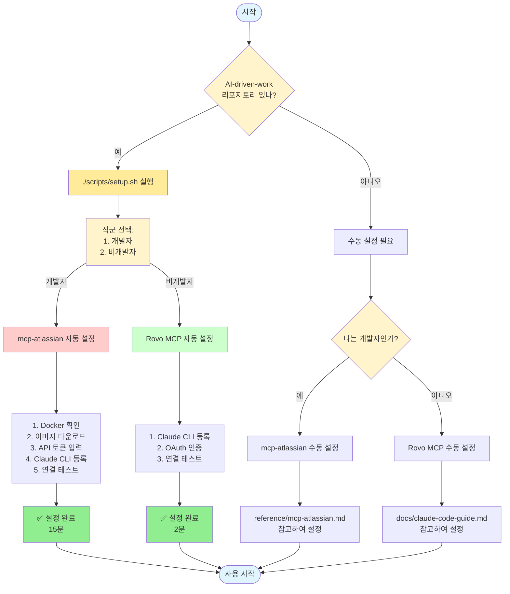
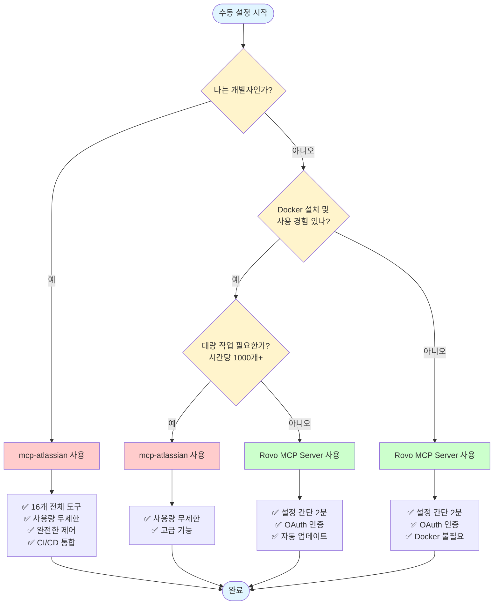

# MCP Server 선택 가이드

## 개요

Claude Code에서 Atlassian(Jira, Confluence)과 연동하기 위한 두 가지 MCP 서버 옵션이 있습니다:

1. **Atlassian Rovo MCP Server** (클라우드 기반)
2. **mcp-atlassian (sooperset)** (로컬 Docker 기반)

이 문서는 **직군별로 어떤 MCP 서버를 사용하는 것이 최적인지** 안내합니다.

## 핵심 차이점 요약

| 특성 | Rovo MCP Server | mcp-atlassian |
|-----|----------------|---------------|
| **설정 난이도** | 매우 쉬움 (한 줄) | 중간 (Docker + 설정) |
| **인증 방식** | OAuth (브라우저 클릭) | API 토큰 (수동 발급) |
| **사전 요구사항** | 없음 | Docker 설치 |
| **사용량 제한** | 시간당 1,000개 | 무제한 |
| **지원 도구** | 제한적 | 16개 (Jira 11 + Confluence 5) |
| **고급 기능** | 없음 | 필터링, 읽기 전용, 프록시 |
| **안정성** | 베타 (재인증 이슈) | 안정적 |
| **비용** | 무료 (베타) | 무료 (영구) |

## 직군별 권장 사항

### 비개발 직군 → Atlassian Rovo MCP Server ⭐

**대상**:
- 기획자 (PM, PO)
- 디자이너
- 마케터
- 운영팀
- 경영지원

#### 권장 이유

##### 1. 압도적으로 간단한 설정
```bash
# 단 한 줄로 설정 완료
claude mcp add --transport sse atlassian https://mcp.atlassian.com/v1/sse
```

**vs mcp-atlassian**:
- Docker 설치 필요 ❌
- API 토큰 발급 필요 ❌
- 환경 변수 설정 필요 ❌
- JSON 파일 편집 필요 ❌

##### 2. OAuth 인증의 편리함
- 웹 브라우저에서 클릭 몇 번으로 인증 완료
- API 토큰 복사/붙여넣기 불필요
- 토큰 분실 걱정 없음
- 토큰 갱신 자동

##### 3. IT 지식 불필요
- Docker가 무엇인지 몰라도 됨
- 터미널 사용 최소화
- 설정 파일 편집 불필요

##### 4. 일반 업무에 충분
비개발 직군의 일반적인 사용 패턴:
- 하루 10-50회 정도 조회
- 간단한 이슈 생성/업데이트
- 문서 검색 및 읽기
- 주간 보고서 작성

→ **시간당 1,000개 제한을 넘을 일이 거의 없음**

##### 5. 자동 업데이트
- Atlassian이 자동으로 서버 관리
- 새 기능 자동 추가
- 보안 패치 자동 적용

#### 설정 방법

##### 방법 1: 자동 설정 (권장) ⭐

```bash
# AI-driven-work 리포지토리에서
./scripts/setup.sh
```

스크립트가 자동으로:
1. 직군 확인 (비개발자 선택)
2. Rovo MCP Server 추천
3. Claude Code CLI에 자동 등록
4. OAuth 인증 브라우저 실행
5. 연결 테스트

**총 소요 시간**: 2분

##### 방법 2: 수동 설정

**단계 1: Claude Code에서 한 줄 실행**
```bash
claude mcp add --transport sse atlassian https://mcp.atlassian.com/v1/sse
```

**단계 2: 브라우저에서 인증**
1. 자동으로 브라우저 열림
2. Atlassian 계정으로 로그인
3. "Allow" 버튼 클릭
4. 완료!

**총 소요 시간**: 2분

#### 사용 예시

```
"오늘 나한테 할당된 Jira 이슈 보여줘"
"PROJ-123 이슈를 In Progress로 바꿔줘"
"Confluence에서 마케팅 전략 문서 찾아줘"
"이번 주 완료한 이슈로 주간 보고서 만들어줘"
```

#### 주의사항

**재인증 필요할 수 있음**
- 증상: 며칠 사용 안 하면 "Connect Atlassian Account" 메시지
- 해결: 브라우저에서 다시 로그인 (1분)

**인터넷 필수**
- 오프라인에서는 작동 안 함
- 안정적인 인터넷 연결 필요

---

### 개발 직군 → mcp-atlassian (sooperset) ⭐

**대상**:
- 백엔드 개발자
- 프론트엔드 개발자
- DevOps 엔지니어
- QA 엔지니어
- 데이터 엔지니어

#### 권장 이유

##### 1. 완전한 제어와 유연성

**16개의 전체 도구 사용**:

Jira (11개):
- `jira_create_issue` - 이슈 생성
- `jira_get_issue` - 이슈 조회
- `jira_update_issue` - 이슈 업데이트
- `jira_search` - JQL 검색
- `jira_change_issue_status` - 상태 변경
- `jira_get_all_projects` - 프로젝트 목록
- `jira_get_agile_boards` - 보드 조회
- `jira_get_sprints_from_board` - 스프린트 조회
- `jira_get_sprint_issues` - 스프린트 이슈
- `jira_get_board_issues` - 보드 이슈
- `jira_link_an_issue_to_a_specific_Epic` - Epic 연결

Confluence (5개):
- `confluence_search` - 검색
- `confluence_get_page` - 페이지 조회
- `confluence_create_page` - 페이지 생성
- `confluence_update_page` - 페이지 업데이트
- `confluence_get_comments` - 댓글 조회

##### 2. 고급 기능 및 설정

**필터링**:
```bash
# 특정 프로젝트만 접근
JIRA_PROJECTS_FILTER=PROJ,DEV,INFRA

# 특정 Confluence 스페이스만 접근
CONFLUENCE_SPACES_FILTER=DEV,DEVOPS,TECH
```

**읽기 전용 모드**:
```bash
# 조회만 가능, 실수로 데이터 변경 방지
READ_ONLY_MODE=true
```

**도구 선택**:
```bash
# 필요한 도구만 활성화
ENABLED_TOOLS=jira_search,jira_get_issue,confluence_search
```

**프록시 지원**:
```bash
# 회사 프록시 환경
HTTPS_PROXY=https://proxy.company.com:8443
JIRA_HTTPS_PROXY=https://jira-proxy.company.com:8443
```

##### 3. 사용량 무제한

개발자의 일반적인 사용 패턴:
- **CI/CD 자동화**: 빌드마다 이슈 업데이트
- **스크립트**: 대량 이슈 처리
- **배치 작업**: 수백 개 이슈 조회/업데이트
- **개발 도구 통합**: IDE, Git hooks

→ **시간당 1,000개 제한을 쉽게 초과할 수 있음**

예시:
```bash
# 스프린트 시작 시 100개 이슈 자동 업데이트
# CI/CD에서 배포마다 10개 이슈 업데이트
# 하루에 10번 배포 = 100개
# 수동 조회/업데이트 = 200개
# 총 300개/일 → Rovo는 충분
# 하지만 스크립트로 1000개 이슈 한번에 처리하면? → Rovo 제한 초과
```

##### 4. 안정성 및 예측 가능성

- ✅ **베타 아님**: 검증된 안정 버전
- ✅ **재인증 불필요**: API 토큰 한번 설정으로 영구 사용
- ✅ **로컬 실행**: 외부 서비스 장애 영향 없음
- ✅ **오프라인 가능**: API 호출 시에만 인터넷 필요

##### 5. Server/Data Center 지원

온프레미스 환경:
- Confluence Server/Data Center 6.0+
- Jira Server/Data Center 8.14+

→ **Rovo는 Cloud 전용**

##### 6. Docker 친숙함

개발자는 Docker를 이미 사용:
- 로컬 개발 환경
- 컨테이너 배포
- CI/CD 파이프라인

→ Docker 설치 및 사용이 부담스럽지 않음

#### 설정 방법

##### 방법 1: 자동 설정 (권장) ⭐

```bash
# AI-driven-work 리포지토리에서
./scripts/setup.sh
```

스크립트가 자동으로:
1. 직군 확인 (개발자 선택)
2. mcp-atlassian 추천
3. Docker 설치 확인
4. Docker 이미지 다운로드
5. API 토큰 입력 안내 (또는 기존 설정 재사용)
6. 환경 변수 파일 생성 (`~/.mcp-atlassian/.env`)
7. Claude Code CLI 자동 등록 (`claude mcp add`)
8. 사용 범위 선택 (모든 프로젝트 vs 현재 프로젝트만)
9. 연결 테스트

**기존 설정이 있는 경우**:
- 이메일 정보 표시
- 기존 설정 재사용 or 새로 입력 선택 가능
- Enter만 누르면 빠른 재설정

**총 소요 시간**:
- 첫 설정: 15분 (Docker 이미 설치된 경우 10분)
- 재설정: 1분 (기존 설정 재사용)

##### 방법 2: 수동 설정

**단계 1: Docker 설치 확인**
```bash
docker --version
# 미설치 시: https://docs.docker.com/get-docker/
```

**단계 2: Docker 이미지 다운로드**
```bash
docker pull ghcr.io/sooperset/mcp-atlassian:latest
```

**단계 3: API 토큰 발급**
1. https://id.atlassian.com/manage-profile/security/api-tokens
2. "Create API token" 클릭
3. 이름: "MCP-ATLASSIAN"
4. 토큰 복사 (안전하게 저장)

**단계 4: 환경 변수 파일 생성**

`~/.mcp-atlassian/.env`:
```bash
CONFLUENCE_URL=https://popupstudio.atlassian.net/wiki
CONFLUENCE_USERNAME=your.email@popupstudio.com
CONFLUENCE_API_TOKEN=your_confluence_token

JIRA_URL=https://popupstudio.atlassian.net
JIRA_USERNAME=your.email@popupstudio.com
JIRA_API_TOKEN=your_jira_token

# 개발 프로젝트만 필터링
JIRA_PROJECTS_FILTER=PROJ,DEV,INFRA
CONFLUENCE_SPACES_FILTER=DEV,DEVOPS,TECH

# 필요 시 읽기 전용
# READ_ONLY_MODE=true
```

**보안 설정**:
```bash
chmod 600 ~/.mcp-atlassian/.env
```

**단계 5: Claude Code CLI 등록**
```bash
# 모든 프로젝트에서 사용 (권장)
claude mcp add --scope user --transport stdio mcp-atlassian -- \
  docker run -i --rm --env-file ~/.mcp-atlassian/.env \
  ghcr.io/sooperset/mcp-atlassian:latest

# 또는 현재 프로젝트에서만 사용
claude mcp add --scope local --transport stdio mcp-atlassian -- \
  docker run -i --rm --env-file ~/.mcp-atlassian/.env \
  ghcr.io/sooperset/mcp-atlassian:latest
```

**단계 6: 연결 확인**
```bash
claude mcp list
```

**단계 7: 테스트**
```bash
claude
```

```
"Jira 프로젝트 목록 보여줘"
```

**총 소요 시간**: 15분 (Docker 이미 설치된 경우 10분)

#### 고급 사용 예시

**CI/CD 통합**:
```bash
# 배포 성공 시 Jira 이슈 자동 업데이트
docker run --rm \
  --env-file ~/.mcp-atlassian/.env \
  ghcr.io/sooperset/mcp-atlassian:latest \
  update-issue PROJ-123 "Deployed to production"
```

**대량 이슈 처리**:
```
"지난 스프린트의 모든 완료된 이슈를 조회해서 Confluence에 릴리스 노트 작성해줘"
→ 100개 이슈 조회 + 1개 페이지 생성
```

**JQL 활용**:
```
"project = PROJ AND status = 'In Progress' AND assignee = currentUser() 인 이슈들을 우선순위 순으로 정렬해서 보여줘"
→ jira_search 도구로 복잡한 JQL 쿼리 실행
```

**읽기 전용 모드로 안전한 조회**:
```bash
READ_ONLY_MODE=true
```
→ 실수로 이슈 수정 방지, 프로덕션 데이터 안전

---

## 상황별 권장

### ✅ Rovo MCP Server를 사용하세요

**직군**:
- 기획자, 디자이너, 마케터, 운영팀

**상황**:
- ✅ 일반적인 업무 사용 (조회, 간단한 업데이트)
- ✅ 하루 사용량이 적음 (100회 미만)
- ✅ Docker 설치가 어려움
- ✅ 빠른 설정 원함 (2분)
- ✅ IT 지식이 많지 않음
- ✅ 자동 업데이트 선호
- ✅ OAuth 인증 선호

**장점**:
- 🚀 설정이 매우 간단
- 🔐 OAuth 인증
- 🔄 자동 업데이트
- 💰 무료 (현재)

**단점**:
- ⚠️ 사용량 제한 (시간당 1,000개)
- ⚠️ 재인증 필요할 수 있음
- ⚠️ 인터넷 필수
- ⚠️ 제한적인 도구

---

### ✅ mcp-atlassian을 사용하세요

**직군**:
- 개발자 (백엔드, 프론트엔드, DevOps, QA, 데이터)

**상황**:
- ✅ 대량 작업 필요 (시간당 1,000개 이상)
- ✅ CI/CD 자동화
- ✅ 스크립트/배치 작업
- ✅ 고급 기능 필요 (필터링, 읽기 전용)
- ✅ 완전한 제어 원함
- ✅ Server/Data Center 사용
- ✅ 프록시 환경
- ✅ 안정성 최우선
- ✅ Docker 사용 경험 있음

**장점**:
- 🔧 완전한 제어
- 💪 16개 전체 도구
- ∞ 사용량 무제한
- 🏢 Server/DC 지원
- 🔒 고급 보안 설정
- 💰 무료 (영구)

**단점**:
- ⚙️ 설정이 복잡함 (15분)
- 🐳 Docker 필요
- 🔑 API 토큰 관리

---

## 혼용 시나리오

두 MCP 서버를 **동시에 설치하여 상황에 따라 선택 사용**할 수도 있습니다.

### 설정 방법

**1. 서로 다른 이름으로 설정**

`~/.config/claude/mcp/claude_desktop_config.json`:
```json
{
  "mcpServers": {
    "atlassian-rovo": {
      "type": "sse",
      "url": "https://mcp.atlassian.com/v1/sse"
    },
    "atlassian-local": {
      "command": "docker",
      "args": [
        "run",
        "-i",
        "--rm",
        "--env-file", "${HOME}/.mcp-atlassian/.env",
        "ghcr.io/sooperset/mcp-atlassian:latest"
      ]
    }
  }
}
```

**2. 사용 시 명시적으로 지정**

Claude Code는 자동으로 적절한 서버를 선택합니다.

### 혼용 전략 (개발자용)

**일반 업무**: Rovo MCP Server
- 간단한 이슈 조회
- 상태 업데이트
- 문서 검색

**고급 작업**: mcp-atlassian
- CI/CD 통합
- 대량 이슈 처리
- 복잡한 JQL 쿼리
- 스크립트 작업

---

## 실전 가이드: 팀별 설정

### 기획팀

**권장**: Atlassian Rovo MCP Server

**빠른 설정**:
```bash
./scripts/setup.sh
# → 비개발자(2) 선택
# → Rovo MCP Server(1) 선택
# → 2분 완료
```

**수동 설정**: `docs/claude-code-guide.md` 참고

**일일 업무**:
```
아침 9시:
"오늘 나한테 할당된 이슈 보여줘"
"/daily-standup"

오후 2시:
"회의 내용을 바탕으로 Confluence 페이지 작성해줘"

금요일 5시:
"/weekly-report"
```

---

### 개발팀

**권장**: mcp-atlassian (sooperset)

**빠른 설정**:
```bash
./scripts/setup.sh
# → 개발자(1) 선택
# → mcp-atlassian(2) 선택
# → API 토큰 입력 (또는 기존 설정 재사용)
# → 15분 완료 (Docker 이미 설치된 경우 10분)
```

**수동 설정**: `reference/mcp-atlassian.md` 참고

**일일 업무**:
```
아침 9시:
"현재 스프린트의 In Progress 이슈들 보여줘"

배포 시:
"PROJ-123, PROJ-124, PROJ-125를 Done으로 변경하고 Confluence 릴리스 노트에 추가해줘"

코드 리뷰 시:
"이 코드 변경과 관련된 Jira 이슈를 찾아서 연결해줘"

CI/CD:
자동으로 빌드 성공 시 이슈 업데이트
```

---

### 디자인팀

**권장**: Atlassian Rovo MCP Server

**빠른 설정**:
```bash
./scripts/setup.sh
# → 비개발자(2) 선택
# → Rovo MCP Server(1) 선택
# → 2분 완료
```

**수동 설정**: `docs/claude-code-guide.md` 참고

**일일 업무**:
```
디자인 피드백 수집:
"DESIGN 프로젝트의 디자인 리뷰 필요한 이슈들 보여줘"

디자인 문서화:
"디자인 시스템 업데이트 내용을 Confluence에 정리해줘"

이슈 추적:
"내가 작업 중인 디자인 이슈들의 진행 상황 보여줘"
```

---

### DevOps팀

**권장**: mcp-atlassian (sooperset)

**이유**: CI/CD 통합, 대량 이슈 처리, 스크립트 자동화

**빠른 설정**:
```bash
./scripts/setup.sh
# → 개발자(1) 선택
# → mcp-atlassian(2) 선택
# → API 토큰 입력 (또는 기존 설정 재사용)
# → 모든 프로젝트에서 사용(1) 선택 (권장)
# → 15분 완료
```

**수동 설정**: `reference/mcp-atlassian.md` 참고

**일일 업무**:
```
인프라 모니터링:
"INFRA 프로젝트의 긴급 이슈들 보여줘"

자동화:
Docker 컨테이너로 배포 스크립트에 통합
빌드 성공/실패 시 자동 이슈 업데이트

릴리스 노트:
"이번 릴리스에 포함된 모든 이슈를 Confluence에 정리해줘"
```

---

## 의사결정 플로우차트

### 권장 방법: setup.sh 자동 설정 사용



### 수동 설정 시 플로우



---

## 비용 비교

### Atlassian Rovo MCP Server

**현재**: 무료 (베타)

**향후**: 가격 정책 미정 (베타 종료 후)

**위험**: 유료화 가능성

---

### mcp-atlassian (sooperset)

**현재**: 무료 (MIT 라이선스)

**향후**: 무료 (오픈소스)

**위험**: 없음 (영구 무료)

---

## POPUP STUDIO 최종 권장사항

### 직군별 MCP 서버

| 직군 | 1순위 | 2순위 | 이유 |
|-----|------|------|------|
| **기획자** | Rovo | - | 간단한 설정, OAuth |
| **디자이너** | Rovo | - | 간단한 설정, OAuth |
| **마케터** | Rovo | - | 간단한 설정, OAuth |
| **운영팀** | Rovo | - | 간단한 설정, OAuth |
| **개발자** | mcp-atlassian | Rovo | 완전한 제어, 무제한 |
| **DevOps** | mcp-atlassian | - | CI/CD 통합, 자동화 |
| **QA** | mcp-atlassian | Rovo | 대량 테스트, 스크립트 |

### 이유

**비개발 직군 → Rovo**:
- ✅ 설정 2분 vs 15분
- ✅ OAuth vs API 토큰 관리
- ✅ Docker 불필요
- ✅ 일반 업무에 충분

**개발 직군 → mcp-atlassian**:
- ✅ 16개 도구 vs 제한적
- ✅ 무제한 vs 시간당 1,000개
- ✅ 고급 기능 (필터링, 읽기 전용)
- ✅ CI/CD 통합 가능
- ✅ 안정성 (베타 아님)

---

## 다음 단계

### 모든 직군 - 자동 설정 (권장) ⭐

```bash
# 1. 리포지토리 클론 (아직 안 했다면)
git clone https://github.com/popupstudio/AI-driven-work.git
cd AI-driven-work

# 2. 자동 설정 실행
./scripts/setup.sh

# 3. 안내에 따라 진행
# - 직군 선택 (개발자 / 비개발자)
# - MCP Server 선택 (Rovo / mcp-atlassian)
# - 필요 시 API 토큰 입력 (또는 기존 설정 재사용)

# 4. 완료!
claude
```

### 비개발 직군 - 수동 설정

1. `docs/claude-code-guide.md` 읽기
2. Rovo MCP Server 설정 (2분)
   ```bash
   claude mcp add --transport sse atlassian https://mcp.atlassian.com/v1/sse
   ```
3. OAuth 인증
4. 사용 시작!

### 개발 직군 - 수동 설정

1. `reference/mcp-atlassian.md` 읽기
2. Docker 설치 확인
3. mcp-atlassian 수동 설정 (15분)
4. 고급 기능 활용 (필터링, 읽기 전용 등)

### 재설정이 필요한 경우

```bash
# setup.sh를 다시 실행하면 기존 설정을 재사용할 수 있습니다
cd AI-driven-work
./scripts/setup.sh

# 기존 설정 발견 시:
# 1. 기존 설정 사용 (빠른 재설정) ← Enter만 누르면 됨
# 2. 새로 입력 (계정 변경)
```

---

## 추가 리소스

### 문서
- **비개발자 가이드**: `docs/claude-code-guide.md`
- **Rovo 상세 정보**: `reference/atlassian-rovo-mcp-server.md`
- **mcp-atlassian 상세 정보**: `reference/mcp-atlassian.md`
- **설정 방법**: `config/README.md`

### 외부 링크
- [Rovo 공식 문서](https://support.atlassian.com/atlassian-rovo-mcp-server/)
- [mcp-atlassian GitHub](https://github.com/sooperset/mcp-atlassian)

---

## 결론

**직군별 선택은 업무 특성과 기술 친숙도를 고려한 합리적인 접근입니다.**

- **비개발 직군**: Rovo MCP Server - 간편함과 충분한 기능
- **개발 직군**: mcp-atlassian - 완전한 제어와 무제한 사용

**두 옵션 모두 무료**이므로, 부담 없이 시도하고 팀에 맞는 것을 선택하세요!

---

**작성일**: 2025-11-06
**작성자**: Claude Code
**버전**: 1.0
**대상**: POPUP STUDIO 전 직원
